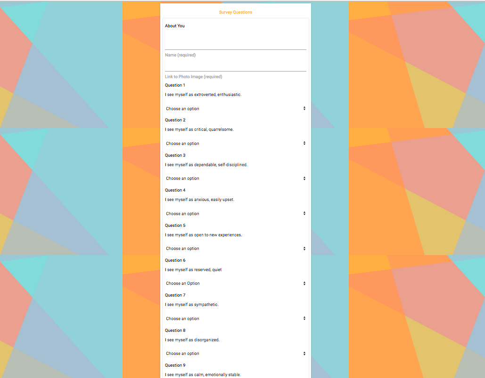

## "FriendFinder" application 

Basically a dating app. 

This full-stack site will take in results from your users' surveys, then compare their answers with those from other users. The app will then display the name and picture of the user with the best overall match.

When the user submits the survey, they are matched with a "friend" that has the closest match to their personality. 

# Live Site

https://ms-friend-finder.herokuapp.com/

# Screen Shots

Index Page

Survey 

# Technologies used

- Node.js
- Express NPM Package
- HTML 
- CSS 
- AJAX 
- Body-Parser NPM Package

## Prerequisites

- Node.js (Download the latest version of Node) https://nodejs.org/en/
- Materialize - http://materializecss.com/getting-started.html

## Built With 

- Visual Studio Code
- Materialize - Wireframe

